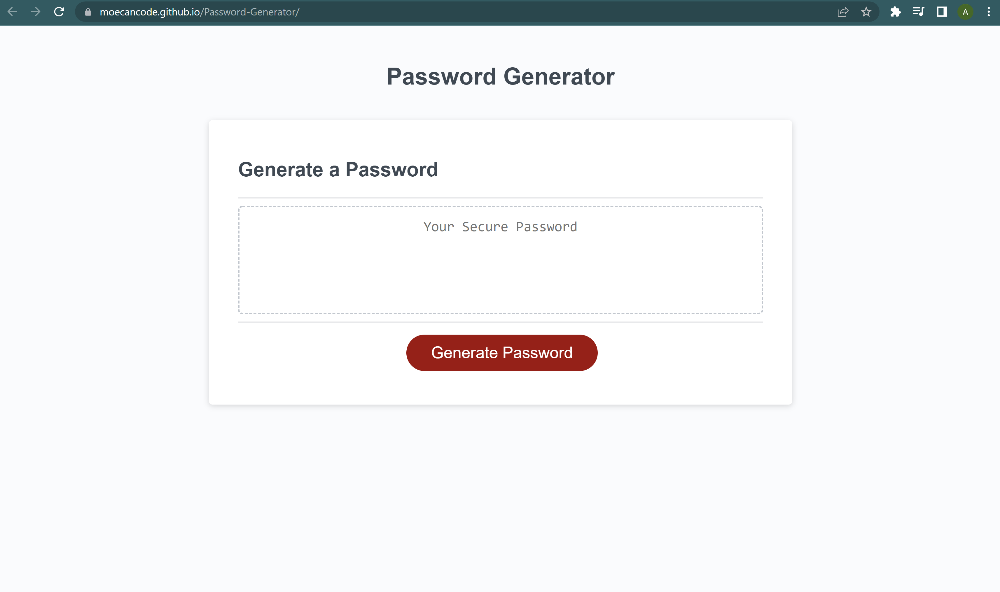
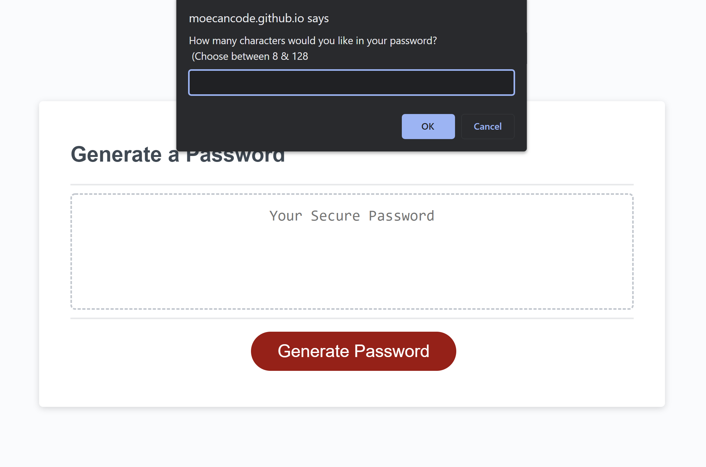
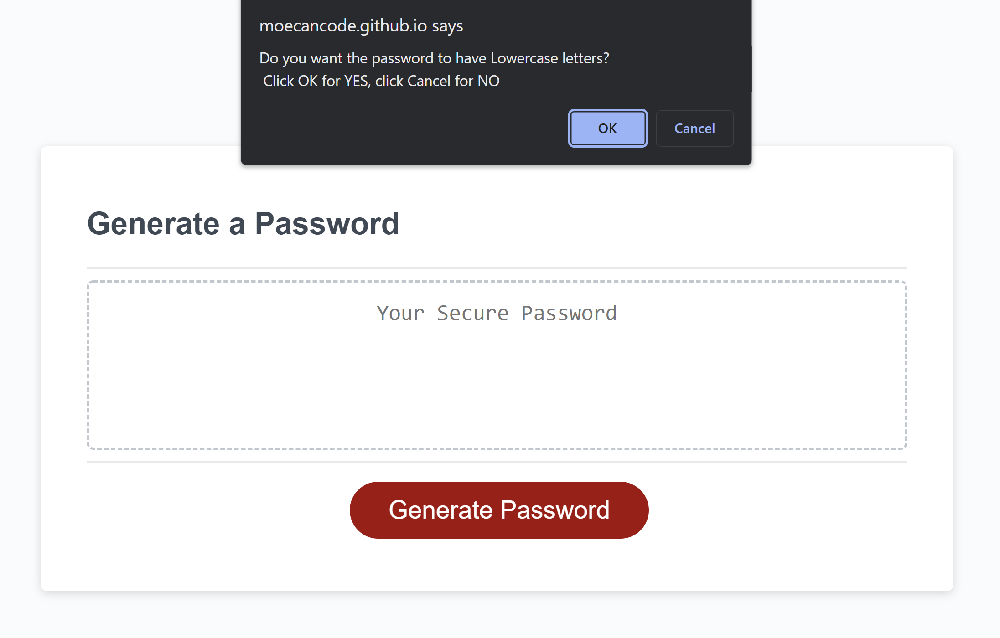
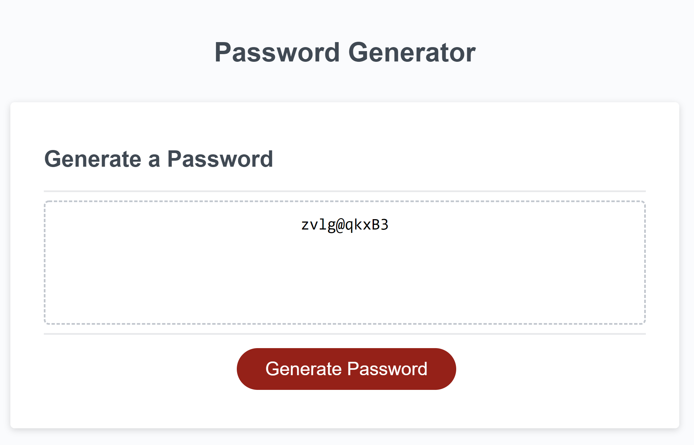

# Password-Generator

This webpage generates a password for a user after requesting a few inputs. It prompts for the required length of the password to be generated and also allows you to omit the use of certain categories of characters in the output.

The generated password can then be easily copied and used wherever it is needed.

# Layout

 

The webpage has a simple layout and makes use of basic styling. Focus was placed on the functionality of the Password Generator.

 

# Working

The user is prompted to input the number of characters they would like for their password once the "Generate password" button is clicked.

 

 

If the number does not fall within the specified range (8 to 128) an alert is generated and the user has to start over. If the input was within the specified range the program then asks if the user would like to exclude any of the following when generating the password:

- Lowercase letters
- Uppercase letters
- Numbers
- Special Characters

 

 

Notice that in this part we made use of <code>Confirm</code> instead of <code>Prompt</code>. This was done to make the code more readable and easy to understand. If we had prompted for a "yes/no" answer for ever question, there would be a bunch more conditional statements in the code that would make it confusing.

Clicking "OK" for one or more of the questions leads to the password being generated and it can be copied for use.

 

 

# Contributors

**Mohammad Abuzar Razvi**

 

# License

MIT License

Copyright (c) [2022] [Mohammad Abuzar Razvi]

Permission is hereby granted, free of charge, to any person obtaining a copy
of this software and associated documentation files (the "Software"), to deal
in the Software without restriction, including without limitation the rights
to use, copy, modify, merge, publish, distribute, sublicense, and/or sell
copies of the Software, and to permit persons to whom the Software is
furnished to do so, subject to the following conditions:

The above copyright notice and this permission notice shall be included in all
copies or substantial portions of the Software.

THE SOFTWARE IS PROVIDED "AS IS", WITHOUT WARRANTY OF ANY KIND, EXPRESS OR
IMPLIED, INCLUDING BUT NOT LIMITED TO THE WARRANTIES OF MERCHANTABILITY,
FITNESS FOR A PARTICULAR PURPOSE AND NONINFRINGEMENT. IN NO EVENT SHALL THE
AUTHORS OR COPYRIGHT HOLDERS BE LIABLE FOR ANY CLAIM, DAMAGES OR OTHER
LIABILITY, WHETHER IN AN ACTION OF CONTRACT, TORT OR OTHERWISE, ARISING FROM,
OUT OF OR IN CONNECTION WITH THE SOFTWARE OR THE USE OR OTHER DEALINGS IN THE
SOFTWARE.